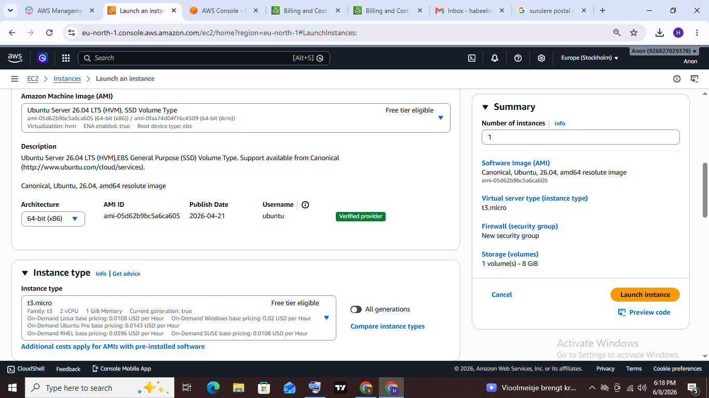
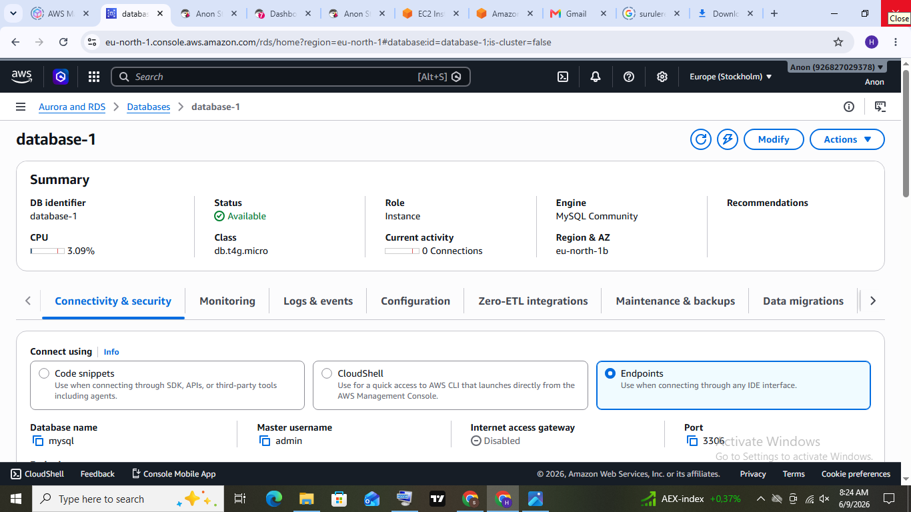
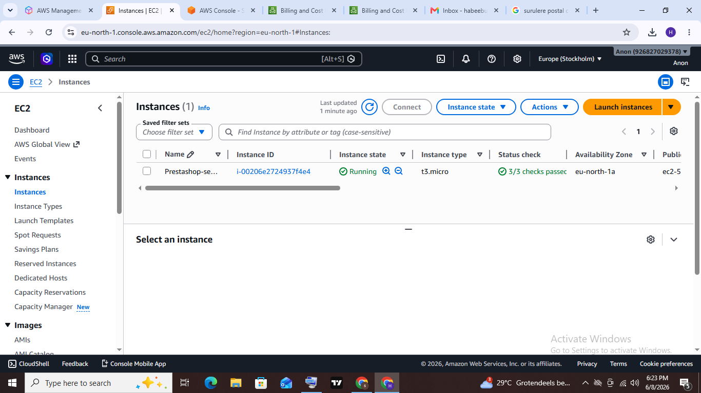
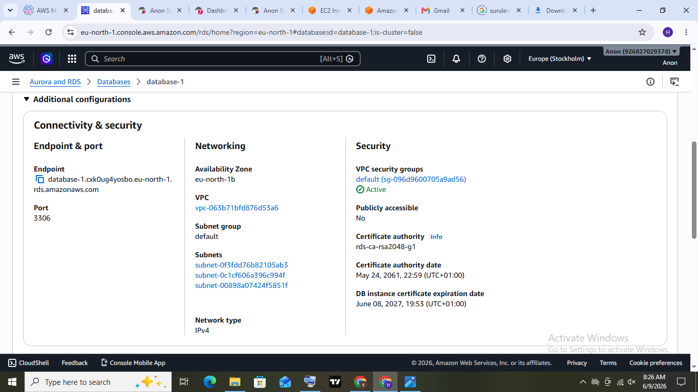
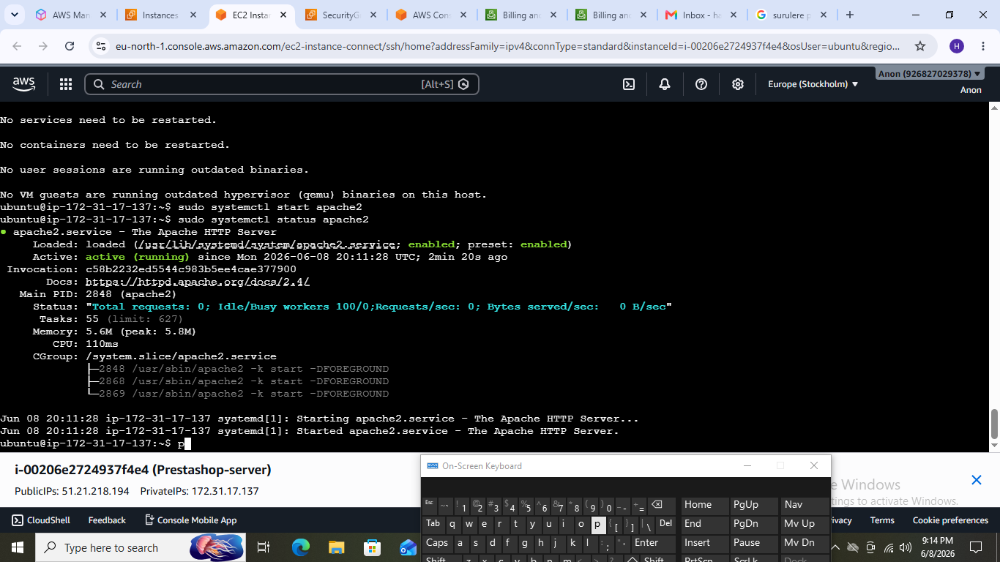
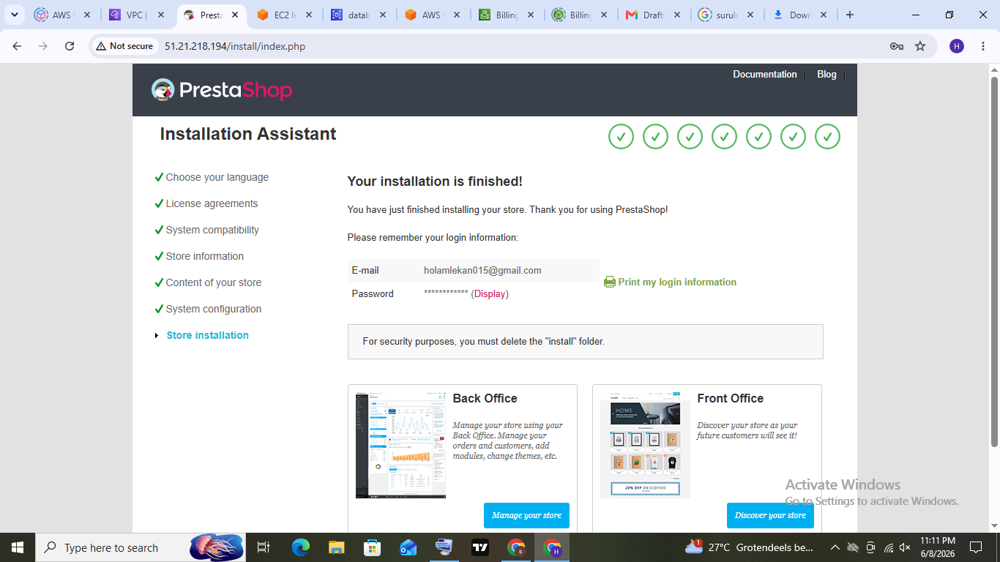

# prestashop-on-aws
Practical Deployment of Prestashop on Amazon Web Services (AWS)

## Project Overview

This project demonstrates the deployment of a PrestaShop e-commerce website on Amazon Web Services (AWS). The goal was to create a functional online store hosted on an AWS EC2 instance running Ubuntu Server with Apache, PHP, and MySQL.

The project was completed as part of my cloud computing learning journey to gain hands-on experience with deploying web applications on AWS.

## Objectives

- Deploy an Ubuntu Server on AWS EC2.
- Configure Apache Web Server.
- Install PHP and required extensions.
- Install and configure MySQL.
- Deploy the PrestaShop application.
- Configure Security Groups for web access.
- Verify that the website is accessible through a web browser.

## Technologies Used

- Amazon Web Services (AWS)
- Amazon EC2
- Ubuntu Server
- Apache2
- PHP
- MySQL
- PrestaShop

## Project Architecture
The deployment consists of:

- AWS EC2 Instance
- Ubuntu Server
- Apache Web Server
- PHP
- MySQL Database
- PrestaShop Application
- Web Browser (Client)

## Deployment Steps
- Launch an Ubuntu EC2 instance.
- Configure the Security Group to allow HTTP, HTTPS, and SSH traffic.
- Connect to the instance using SSH.
- Update the server packages.
- Install Apache.
- Install PHP and the required PHP extensions.
- Install MySQL Server.
- Create a database for PrestaShop.
- Download and install PrestaShop.
- Complete the installation using the web interface.
- Verify that the website is running successfully.

## Project Screenshots

## Skills Demonstrated
AWS EC2 deployment
Linux server administration
Apache configuration
PHP installation
MySQL database setup
Web application deployment
Basic cloud networking
GitHub documentation

## Lessons Learned
Through this project, I gained practical experience in deploying a web application on AWS. I learned how different cloud services work together, how to configure a Linux server, install required software, troubleshoot deployment issues, and document a technical project using GitHub.

## What I'd Like to Explore Next

* Securing the deployment further. restricting SSH access, enabling HTTPS
* Learning more about how AWS Security Groups and IAM permissions work
* Understanding basic monitoring and backup practices for a live server

-------
Habeebullah Abdulwahab · Aspiring Cybersecurity Professional
GitHub: github.com/Olamil · LinkedIn: linkedin.com/in/abdulwahabhabeeb
